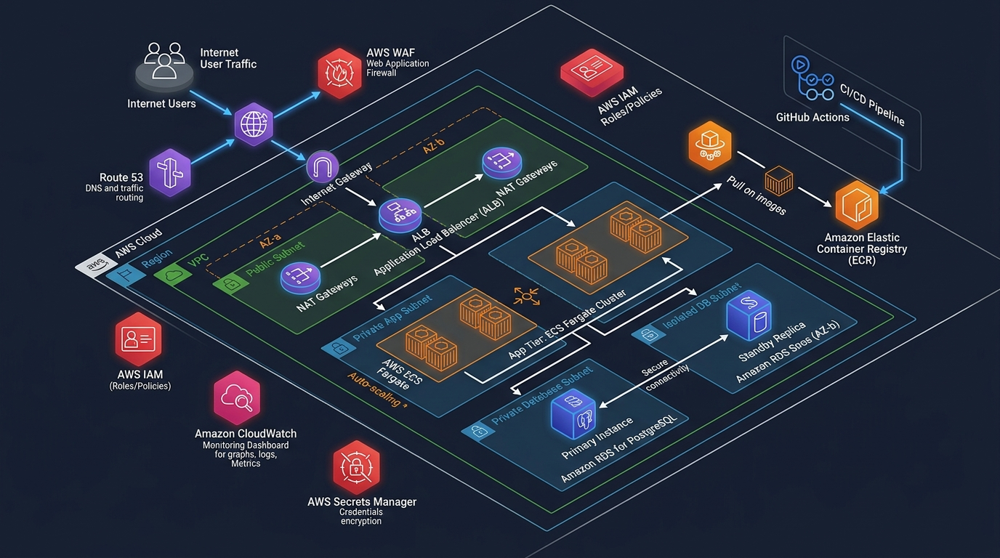

# 🚀 Production-Grade AWS Application Platform

[](https://www.terraform.io/)
[](https://aws.amazon.com/)
[](https://fastapi.tiangolo.com/)
[](https://www.postgresql.org/)
[](https://www.docker.com/)

A portfolio-grade, production-ready cloud architecture designed and provisioned entirely via **Terraform (Infrastructure as Code)** on **Amazon Web Services (AWS)**. 

The architecture deploys a containerized **FastAPI** microservice backed by **Amazon RDS PostgreSQL** across multiple Availability Zones, implementing enterprise networking, security, automated scaling, and observability.

---

## 📐 Architecture Overview



### Key Architectural Pillars:
1. **Multi-AZ Resilience:** High availability across two AWS Availability Zones (AZ-a & AZ-b) with automated health check failover.
2. **3-Tier Network Isolation:**
   - **Public Subnets:** Application Load Balancer (ALB) and NAT Gateway.
   - **Private Application Subnets:** ECS Fargate tasks with zero public IPs.
   - **Isolated Database Subnets:** RDS PostgreSQL with no internet access.
3. **Zero-Trust Security:**
   - Security groups chained by reference (ALB $\rightarrow$ ECS $\rightarrow$ RDS).
   - Database credentials dynamically provisioned in **AWS Secrets Manager**.
   - Non-root container execution with least-privilege IAM policies.
4. **Full Observability:** Real-time **CloudWatch Metrics Dashboard**, log streams, and metric alarms for 5XX errors and CPU utilization.
5. **CI/CD Automation:** **GitHub Actions** workflow for automated linting, container building, ECR publishing, and ECS zero-downtime deployments.

---

## 📂 Repository Structure

```
├── app/                        # Application Code (FastAPI + SQLAlchemy)
│   ├── main.py                 # REST API endpoints & health probes
│   ├── database.py             # DB connection pool & health checks
│   ├── models.py               # SQLAlchemy ORM models (Items, Orders)
│   ├── schemas.py              # Pydantic data schemas & validations
│   ├── requirements.txt        # Python runtime dependencies
│   └── Dockerfile              # Production multi-stage Dockerfile
│
├── terraform/                  # Infrastructure as Code (Terraform)
│   ├── main.tf                 # Terraform provider & backend
│   ├── variables.tf            # Configurable inputs & CIDR definitions
│   ├── terraform.tfvars        # Environment variable overrides
│   ├── vpc.tf                  # Multi-AZ VPC, subnets, IGW, NAT Gateway
│   ├── security_groups.tf      # Least-privilege firewall rules
│   ├── secrets.tf              # AWS Secrets Manager DB credentials
│   ├── rds.tf                  # Multi-AZ RDS PostgreSQL 16 instance
│   ├── ecr.tf                  # Container Registry with vulnerability scans
│   ├── alb.tf                  # Application Load Balancer & health checks
│   ├── iam.tf                  # Least-privilege IAM roles & policies
│   ├── ecs.tf                  # ECS Fargate cluster, task def, service, auto-scaling
│   ├── cloudwatch.tf           # Operations dashboard & Metric Alarms
│   └── outputs.tf              # DNS endpoint & resource outputs
│
├── docs/                       # Engineering Documentation & Portfolio Assets
│   ├── architecture.png        # High-definition visual architecture diagram
│   ├── architecture.md         # Deep-dive network & security specification
│   ├── runbook.md              # Operations, failure simulation & testing runbook
│   └── ADR.md                  # Architecture Decision Records
│
├── .github/workflows/
│   └── deploy.yml              # GitHub Actions CI/CD Pipeline
│
├── docker-compose.yml          # Local containerized development stack
└── README.md                   # Project overview & documentation
```

---

## 🛠️ Step-by-Step Deployment Guide

### Prerequisites
- [AWS CLI v2](https://docs.aws.amazon.com/cli/latest/userguide/install-cliv2.html) configured (`aws configure`)
- [Terraform >= 1.5.0](https://developer.hashicorp.com/terraform/install)
- [Docker Desktop](https://www.docker.com/)

---

### Step 1: Local Development & Verification
Test the FastAPI microservice and PostgreSQL database locally using Docker Compose:
```bash
docker compose up --build
```
- Open `http://localhost:8000/docs` in your browser to inspect interactive OpenAPI documentation.
- Test endpoints: `GET /health` and `GET /ready`.

---

### Step 2: Initialize & Review Infrastructure Plan
```bash
cd terraform
terraform init
terraform plan
```
Terraform will calculate an execution plan detailing all VPC, subnets, security groups, RDS, ALB, and ECS resources to be provisioned.

---

### Step 3: Build & Push Initial Container Image to AWS ECR
Before deploying ECS, create the ECR repository and push our container image:
```bash
# 1. Provision ECR repository
terraform apply -target="aws_ecr_repository.app" -auto-approve

# 2. Authenticate Docker with AWS ECR
ACCOUNT_ID=$(aws sts get-caller-identity --query Account --output text)
REGION="us-east-1"
aws ecr get-login-password --region $REGION | docker login --username AWS --password-stdin $ACCOUNT_ID.dkr.ecr.$REGION.amazonaws.com

# 3. Build, Tag & Push Docker Image
docker build -t cloud-app-platform-app ../app
docker tag cloud-app-platform-app:latest $ACCOUNT_ID.dkr.ecr.$REGION.amazonaws.com/cloud-app-platform-app:latest
docker push $ACCOUNT_ID.dkr.ecr.$REGION.amazonaws.com/cloud-app-platform-app:latest
```

---

### Step 4: Provision Full AWS Infrastructure
```bash
terraform apply -auto-approve
```
*Deployment takes approximately 4–6 minutes while AWS creates the Multi-AZ RDS instance, NAT Gateway, and ECS Fargate cluster.*

---

### Step 5: Live Verification & Testing
Upon completion, Terraform will output the public Application Load Balancer DNS:
```bash
# Test Liveness Probe
curl $(terraform output -raw alb_dns_name)/health

# Test Database Readiness Probe
curl $(terraform output -raw alb_dns_name)/ready

# Test Creating an Inventory Item
curl -X POST "$(terraform output -raw alb_dns_name)/items" \
     -H "Content-Type: application/json" \
     -d '{"name": "Ultra-Wide Monitor", "description": "34-inch Curved 144Hz", "price": 499.99, "stock_quantity": 25}'
```

---

## 📊 Observability & Dashboards
Access the **CloudWatch Operations Dashboard** directly via the link outputted by Terraform:
- **ALB Metrics:** Request counts, latency, HTTP 2XX/4XX/5XX error rates.
- **ECS Compute:** Real-time CPU and Memory utilization per task.
- **RDS Performance:** Active database connections and CPU metrics.

---

## 🧹 Teardown (Clean Resource Deletion)
To delete all cloud resources and prevent ongoing charges:
```bash
terraform destroy -auto-approve
```

---

## 👨‍💻 Author
- **GitHub:** [@tahirkhan05](https://github.com/tahirkhan05)
